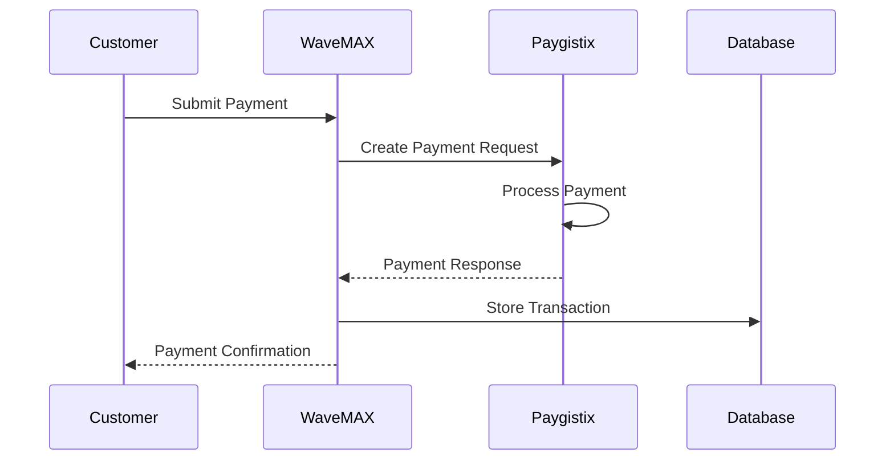

# Paygistix Payment Integration Documentation

## Overview

The WaveMAX Affiliate Program integrates with Paygistix as its primary payment processing solution. Paygistix handles all payment transactions, including customer payments, affiliate payouts, and payment method management.

## Table of Contents

1. [Architecture Overview](#architecture-overview)
2. [Configuration](#configuration)
3. [API Integration](#api-integration)
4. [Payment Flow](#payment-flow)
5. [Security Considerations](#security-considerations)
6. [Error Handling](#error-handling)
7. [Testing](#testing)
8. [Troubleshooting](#troubleshooting)

## Architecture Overview

### Directory Structure
```
server/
├── config/
│   └── paygistix.config.js       # Configuration and environment variables
├── services/
│   └── paygistix/
│       ├── index.js              # Main service export
│       ├── auth.service.js       # Authentication handling
│       ├── payment.service.js    # Payment processing
│       ├── token.service.js      # Token management
│       └── webhook.service.js    # Webhook processing
├── controllers/
│   └── paymentController.js     # Payment endpoints
├── routes/
│   └── paymentRoutes.js         # Payment route definitions
└── models/
    ├── Payment.js               # Payment transaction model
    └── PaymentMethod.js         # Stored payment methods
```

## Configuration

### Environment Variables

Add these to your `.env` file:

```env
# Paygistix API Configuration
PAYGISTIX_API_URL=https://api.paygistix.com/v1
PAYGISTIX_API_KEY=your_api_key_here
PAYGISTIX_API_SECRET=your_api_secret_here
PAYGISTIX_WEBHOOK_SECRET=your_webhook_secret_here

# Optional: Test mode
PAYGISTIX_TEST_MODE=true
```

### Configuration File (`paygistix.config.js`)

```javascript
module.exports = {
  apiUrl: process.env.PAYGISTIX_API_URL || 'https://api.paygistix.com/v1',
  apiKey: process.env.PAYGISTIX_API_KEY,
  apiSecret: process.env.PAYGISTIX_API_SECRET,
  webhookSecret: process.env.PAYGISTIX_WEBHOOK_SECRET,
  testMode: process.env.PAYGISTIX_TEST_MODE === 'true',
  timeout: 30000, // 30 seconds
  retryAttempts: 3,
  retryDelay: 1000 // 1 second
};
```

## API Integration

### Authentication Service

The authentication service handles API key management and request signing:

```javascript
// server/services/paygistix/auth.service.js
class PaygistixAuthService {
  generateSignature(payload, timestamp) {
    // Creates HMAC-SHA256 signature for request authentication
  }
  
  getAuthHeaders() {
    // Returns required authentication headers
  }
}
```

### Payment Service

Core payment processing functionality:

```javascript
// server/services/paygistix/payment.service.js
class PaygistixPaymentService {
  async createPayment(paymentData) {
    // Process a new payment
  }
  
  async getPayment(paymentId) {
    // Retrieve payment details
  }
  
  async refundPayment(paymentId, amount) {
    // Process refund
  }
  
  async createPayout(payoutData) {
    // Create affiliate payout
  }
}
```

### Token Service

Handles payment method tokenization:

```javascript
// server/services/paygistix/token.service.js
class PaygistixTokenService {
  async tokenizeCard(cardData) {
    // Tokenize credit card
  }
  
  async tokenizeBankAccount(bankData) {
    // Tokenize bank account
  }
  
  async getToken(tokenId) {
    // Retrieve token details
  }
  
  async deleteToken(tokenId) {
    // Delete stored token
  }
}
```

## Payment Flow

### 1. Customer Payment Flow



#### Implementation Example:

```javascript
// Process customer payment
async processCustomerPayment(req, res) {
  try {
    const { orderId, paymentMethodId, amount } = req.body;
    
    // Create payment with Paygistix
    const payment = await paygistixService.createPayment({
      amount: amount * 100, // Convert to cents
      currency: 'USD',
      paymentMethodId,
      metadata: {
        orderId,
        customerId: req.user.customerId,
        type: 'order_payment'
      }
    });
    
    // Store transaction in database
    const transaction = await Payment.create({
      orderId,
      customerId: req.user.customerId,
      paygistixPaymentId: payment.id,
      amount,
      status: payment.status,
      type: 'order_payment'
    });
    
    // Update order payment status
    await Order.findOneAndUpdate(
      { orderId },
      { 
        paymentStatus: 'completed',
        paidAt: new Date()
      }
    );
    
    res.json({
      success: true,
      transactionId: transaction._id,
      status: payment.status
    });
    
  } catch (error) {
    console.error('Payment processing error:', error);
    res.status(400).json({
      success: false,
      message: 'Payment processing failed'
    });
  }
}
```

### 2. Affiliate Payout Flow

```javascript
// Process affiliate payout
async processAffiliatePayout(req, res) {
  try {
    const { affiliateId, amount, orders } = req.body;
    
    // Get affiliate's payout method
    const affiliate = await Affiliate.findOne({ affiliateId });
    
    // Create payout with Paygistix
    const payout = await paygistixService.createPayout({
      amount: amount * 100, // Convert to cents
      currency: 'USD',
      destination: affiliate.payoutMethodId,
      metadata: {
        affiliateId,
        orderIds: orders.map(o => o.orderId),
        type: 'affiliate_commission'
      }
    });
    
    // Store payout transaction
    const transaction = await Payment.create({
      affiliateId,
      paygistixPaymentId: payout.id,
      amount,
      status: payout.status,
      type: 'affiliate_payout',
      metadata: { orders }
    });
    
    res.json({
      success: true,
      payoutId: transaction._id,
      status: payout.status
    });
    
  } catch (error) {
    console.error('Payout processing error:', error);
    res.status(400).json({
      success: false,
      message: 'Payout processing failed'
    });
  }
}
```

### 3. Payment Method Management

```javascript
// Add payment method
async addPaymentMethod(req, res) {
  try {
    const { type, tokenId } = req.body;
    const userId = req.user.id;
    
    // Verify token with Paygistix
    const token = await paygistixService.getToken(tokenId);
    
    // Store payment method
    const paymentMethod = await PaymentMethod.create({
      userId,
      paygistixTokenId: tokenId,
      type: token.type,
      last4: token.last4,
      expiryMonth: token.expiryMonth,
      expiryYear: token.expiryYear,
      isDefault: false
    });
    
    res.json({
      success: true,
      paymentMethodId: paymentMethod._id
    });
    
  } catch (error) {
    console.error('Add payment method error:', error);
    res.status(400).json({
      success: false,
      message: 'Failed to add payment method'
    });
  }
}
```

## Webhook Integration

### Webhook Endpoint

```javascript
// server/routes/paymentRoutes.js
router.post('/webhooks/paygistix', 
  express.raw({ type: 'application/json' }),
  paymentController.handleWebhook
);
```

### Webhook Handler

```javascript
// Handle Paygistix webhooks
async handleWebhook(req, res) {
  try {
    // Verify webhook signature
    const signature = req.headers['x-paygistix-signature'];
    const isValid = paygistixService.verifyWebhookSignature(
      req.body,
      signature
    );
    
    if (!isValid) {
      return res.status(401).json({ error: 'Invalid signature' });
    }
    
    const event = JSON.parse(req.body);
    
    // Process event based on type
    switch (event.type) {
      case 'payment.succeeded':
        await this.handlePaymentSuccess(event.data);
        break;
        
      case 'payment.failed':
        await this.handlePaymentFailure(event.data);
        break;
        
      case 'payout.completed':
        await this.handlePayoutComplete(event.data);
        break;
        
      case 'payout.failed':
        await this.handlePayoutFailure(event.data);
        break;
        
      default:
        console.log('Unhandled webhook event:', event.type);
    }
    
    res.json({ received: true });
    
  } catch (error) {
    console.error('Webhook processing error:', error);
    res.status(400).json({ error: 'Webhook processing failed' });
  }
}
```

## Security Considerations

### 1. API Key Security
- Store API keys in environment variables
- Never commit keys to version control
- Use different keys for development/production
- Rotate keys regularly

### 2. Request Signing
All requests to Paygistix are signed with HMAC-SHA256:

```javascript
const crypto = require('crypto');

function generateSignature(payload, secret, timestamp) {
  const message = `${timestamp}.${JSON.stringify(payload)}`;
  return crypto
    .createHmac('sha256', secret)
    .update(message)
    .digest('hex');
}
```

### 3. Webhook Verification
Always verify webhook signatures:

```javascript
function verifyWebhookSignature(payload, signature, secret) {
  const timestamp = signature.split(',')[0].split('=')[1];
  const receivedSig = signature.split(',')[1].split('=')[1];
  
  const expectedSig = crypto
    .createHmac('sha256', secret)
    .update(`${timestamp}.${payload}`)
    .digest('hex');
    
  return crypto.timingSafeEqual(
    Buffer.from(receivedSig),
    Buffer.from(expectedSig)
  );
}
```

### 4. PCI Compliance
- Never store raw credit card data
- Use Paygistix tokenization for all card data
- Implement proper access controls
- Log all payment-related activities

## Error Handling

### Common Error Codes

| Code | Description | Action |
|------|-------------|--------|
| `insufficient_funds` | Payment method has insufficient funds | Notify customer to update payment method |
| `card_declined` | Card was declined by issuer | Request alternative payment method |
| `invalid_token` | Payment token is invalid or expired | Request new payment method |
| `duplicate_payment` | Payment already processed | Check transaction history |
| `payout_limit_exceeded` | Payout exceeds daily limit | Schedule for next day |

### Error Response Handling

```javascript
async function handlePaygistixError(error) {
  const errorCode = error.response?.data?.error?.code;
  
  switch (errorCode) {
    case 'insufficient_funds':
      return {
        userMessage: 'Payment failed due to insufficient funds',
        action: 'update_payment_method'
      };
      
    case 'card_declined':
      return {
        userMessage: 'Your card was declined',
        action: 'try_different_card'
      };
      
    default:
      return {
        userMessage: 'Payment processing failed',
        action: 'contact_support'
      };
  }
}
```

## Testing

### Test Card Numbers

For development/testing, use these test cards:

| Card Number | Scenario |
|-------------|----------|
| 4242 4242 4242 4242 | Successful payment |
| 4000 0000 0000 0002 | Card declined |
| 4000 0000 0000 9995 | Insufficient funds |
| 4000 0000 0000 0069 | Expired card |

### Test Bank Accounts

| Routing | Account | Scenario |
|---------|---------|----------|
| 110000000 | 000123456789 | Successful payout |
| 110000000 | 000999999999 | Failed payout |

### Integration Tests

```javascript
// tests/integration/paygistix.test.js
describe('Paygistix Integration', () => {
  it('should process payment successfully', async () => {
    const payment = await paygistixService.createPayment({
      amount: 5000, // $50.00
      currency: 'USD',
      paymentMethodId: 'pm_test_123',
      metadata: { orderId: 'ORD123' }
    });
    
    expect(payment.status).toBe('succeeded');
    expect(payment.amount).toBe(5000);
  });
  
  it('should handle declined card', async () => {
    try {
      await paygistixService.createPayment({
        amount: 5000,
        paymentMethodId: 'pm_test_declined'
      });
    } catch (error) {
      expect(error.code).toBe('card_declined');
    }
  });
});
```

## Monitoring and Logging

### Payment Logging

```javascript
// Log all payment attempts
async function logPaymentAttempt(paymentData, result, error = null) {
  await PaymentLog.create({
    timestamp: new Date(),
    type: paymentData.type,
    amount: paymentData.amount,
    status: error ? 'failed' : result.status,
    paygistixId: result?.id,
    error: error?.message,
    metadata: paymentData.metadata
  });
}
```

### Monitoring Checklist

1. **Payment Success Rate**
   - Track successful vs failed payments
   - Monitor by payment method type
   - Alert on unusual failure rates

2. **Processing Time**
   - Monitor API response times
   - Track webhook delivery delays
   - Alert on timeouts

3. **Daily Volumes**
   - Track payment volumes
   - Monitor payout amounts
   - Compare against limits

## Troubleshooting

### Common Issues

1. **API Connection Errors**
   ```
   Error: connect ETIMEDOUT
   ```
   - Check network connectivity
   - Verify API URL is correct
   - Check firewall rules

2. **Authentication Failures**
   ```
   Error: Invalid API credentials
   ```
   - Verify API key and secret
   - Check key permissions
   - Ensure proper environment

3. **Webhook Failures**
   ```
   Error: Invalid webhook signature
   ```
   - Verify webhook secret
   - Check timestamp tolerance
   - Ensure raw body parsing

### Debug Mode

Enable debug logging:

```javascript
// Enable in development
if (process.env.NODE_ENV === 'development') {
  paygistixService.enableDebugMode();
}
```

### Support Contacts

- **Technical Support**: support@paygistix.com
- **API Documentation**: https://docs.paygistix.com
- **Status Page**: https://status.paygistix.com

## Best Practices

1. **Idempotency**
   - Use idempotency keys for all payment requests
   - Store and check for duplicate requests

2. **Retry Logic**
   - Implement exponential backoff
   - Limit retry attempts
   - Log all retry attempts

3. **Amount Handling**
   - Always use cents (multiply by 100)
   - Validate amounts before processing
   - Store amounts as integers

4. **Error Messages**
   - Never expose internal errors to users
   - Provide actionable error messages
   - Log detailed errors internally

5. **Testing**
   - Test all error scenarios
   - Verify webhook handling
   - Test idempotency

## Migration Guide

### Migrating from Another Provider

1. **Data Migration**
   - Export existing payment methods
   - Coordinate with Paygistix for token migration
   - Update database references

2. **Code Updates**
   - Update payment service calls
   - Modify webhook handlers
   - Update error handling

3. **Testing Phase**
   - Run parallel processing
   - Verify all payment flows
   - Monitor for issues

4. **Cutover**
   - Schedule during low-traffic period
   - Have rollback plan ready
   - Monitor closely after switch